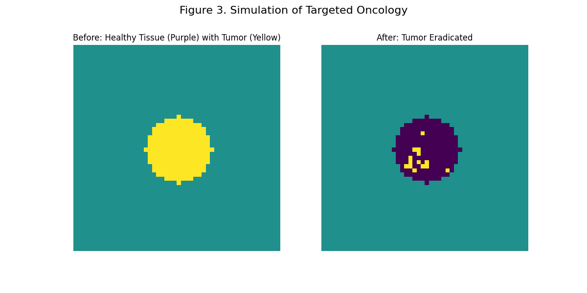
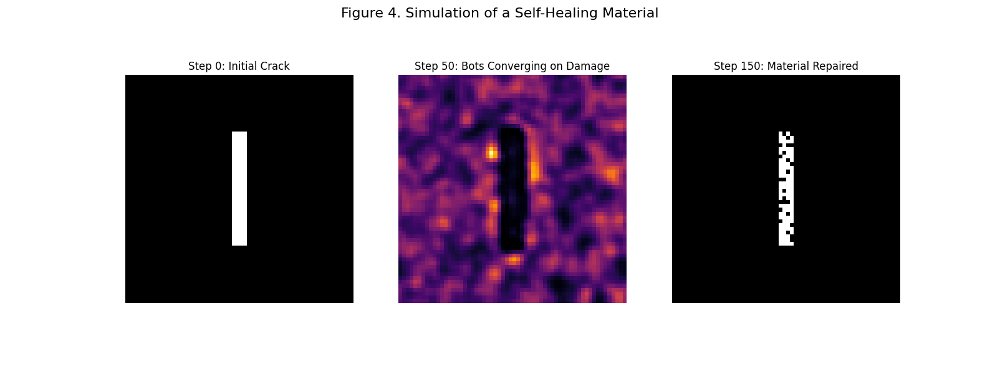
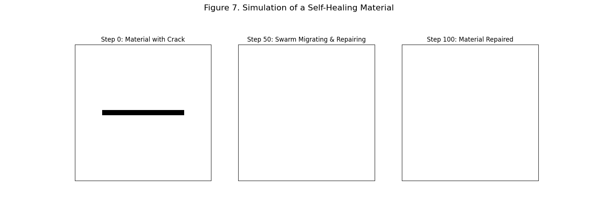
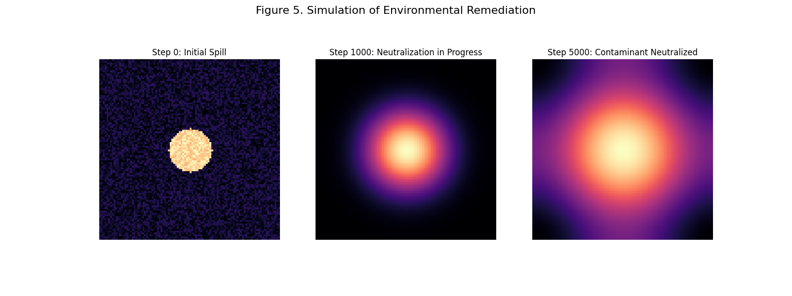
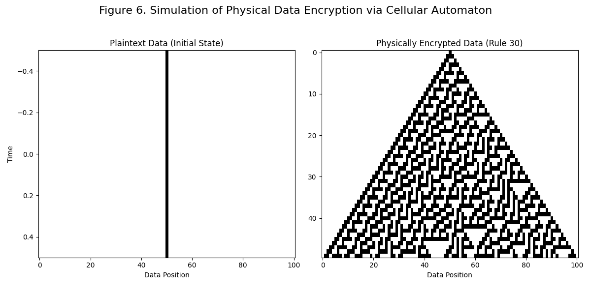
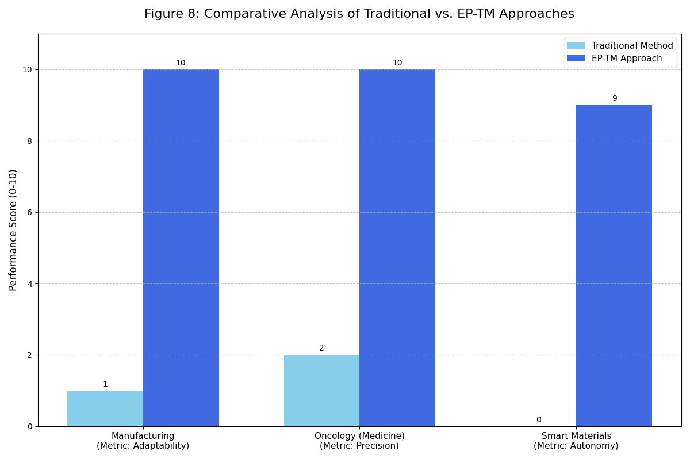

# Emergent Phenomena and Swarm Intelligence Simulations

This repository contains a collection of Python scripts that simulate various complex systems, showcasing principles of emergence, swarm intelligence, and cellular automata. These simulations model applications in manufacturing, medicine, materials science, environmental science, and data encryption.

## Table of Contents

- [Simulations Overview](#simulations-overview)
  - [On-Demand Manufacturing](#on-demand-manufacturing)
  - [Targeted Oncology](#targeted-oncology)
  - [Self-Healing Materials](#self-healing-materials)
  - [Environmental Remediation](#environmental-remediation)
  - [Physical Data Encryption](#physical-data-encryption)
- [Comparative Analysis](#comparative-analysis)
- [Running the Simulations](#running-the-simulations)
- [Dependencies](#dependencies)

## Simulations Overview

This project includes several simulations that demonstrate autonomous agent-based systems.

### On-Demand Manufacturing

**Script:** `manu_env.py`

This simulation (Figure 2) models an on-demand manufacturing process where autonomous bots gather raw materials (yellow) and assemble them into a predefined structure, such as a wire (pink). This demonstrates the potential for decentralized systems in manufacturing.
<p align="center">
  
</p>


### Targeted Oncology

**Script:** `oncology.py`

Figure 3 illustrates a simulation of targeted oncology. Autonomous bots are deployed in healthy tissue (purple) to identify and eliminate a tumor (yellow). The simulation shows the initial state with the tumor and the final state after the tumor has been eradicated, leaving behind benign, treated tissue.

<p align="center">
  
</p>
### Self-Healing Materials

**Scripts:** `healing_sim.py` and `self_repair.py`

These simulations (Figures 4 and 7) model a self-healing material. When a crack appears, autonomous bots converge on the damaged area and repair it.

*   **Figure 4:** This simulation shows the initial crack, the convergence of bots on the damaged area, and the final repaired material.
*   **Figure 7:** This simulation shows the initial material with a crack, the migration and repairing action of a swarm of bots, and the final repaired state.

<p align="center">
  
</p>
<p align="center">
  
</p>
### Environmental Remediation

**Script:** `env_remediation.py`

This simulation (Figure 5) models the neutralization of an environmental contaminant. The simulation begins with an initial spill, shows the neutralization process in progress, and ends with the contaminant fully neutralized.

<p align="center">
  
</p>
### Physical Data Encryption

**Script:** `encryption.py`

This simulation (Figure 6) demonstrates physical data encryption using a cellular automaton (Rule 30). An initial single point of data (plaintext) evolves over time into a complex, encrypted pattern.

<p align="center">
  
</p>
## Comparative Analysis

**Script:** `bar_chart.py`

Figure 8 provides a comparative analysis of traditional methods versus the Emergent Phenomena and Swarm Intelligence (EP-TM) approach across different domains. The chart highlights the superior performance of the EP-TM approach in terms of adaptability, precision, and autonomy.

<p align="center">
  
</p>
## Running the Simulations

To run any of the simulations, execute the desired Python script from your terminal. For example, to run the on-demand manufacturing simulation, use the following command:

```bash
python manu_env.py
```

Each script will generate a plot visualizing the simulation.

## Dependencies

These scripts require the following Python libraries:

*   **NumPy:** For numerical operations and array management.
*   **Matplotlib:** For plotting and visualizing the simulations.

You can install these dependencies using pip:

```bash
pip install numpy matplotlib

```


